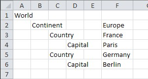

## Synopsis

XML Doc Structure Parser is a data wrangling tool that takes a textual outline
of XML document structure, loads it as a tree of nodes, and allows creating
valid XML document out of it.

## Code Example

Running XML Tree Structure Parser consists of few steps:
1. Define Syntax of your document structure
2. Provide string defining XML document structure
3. Initialize new TreeBuilder
4. Load document tree structure
5. Export in XML format

See code example below:
```python
TREE_STRUCT_SYNTAX = {
    'LINE_PREFIX': r'',
    'INDENT': '  ',
    'NAME_SEPARATOR': '',
    'VALUE_SEPARATOR': r'\s+'
}

tree = """World
  Continent       Europe
    Country       France
      Capital     Paris
    Country       Germany
      Capital     Berlin"""
      

tr = TreeBuilder(TREE_STRUCT_SYNTAX)
tree_root = tr.load(tree)
print(tree_root.xmlify())
```

Results in output:
```xml
<World>
  <Continent>Europe
    <Country>France
      <Capital>Paris</Capital>
    </Country>
    <Country>Germany
      <Capital>Berlin</Capital>
    </Country>
  </Continent>
</World>
```

## Motivation

While there are a lot of tools for editing XML documents and defining their
schema, people often resort to simple human-readable ways of describing
intended document structure. With simple configuration this tool allows
loading many such document structure descriptions, and creating valid XML
from them.

For example, you might see someone defining XML document in Excel spreadsheet
in the way that the document elements are listed on multiple columns and
the values in one column following the structure:



## Installation

Download the files and copy on your hard drive. Test by running
`test_parse_tree_struct.py` and incorporate `TreeBuilder` into your projects.

Requires Python 3.6.

## Contributors

Any feedback is welcome. Please raise a ticket on GitHub.

## License

MIT License
